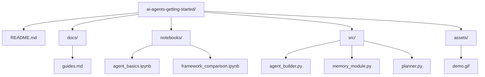

# 🧠 Getting Started with AI Agents


## ✨ Introduction

Se lancer dans le monde des **Agents IA** peut sembler complexe au premier abord.  
Ce guide a pour but de vous aider à **accélérer votre apprentissage** en vous fournissant une feuille de route claire et des ressources de qualité.

📊 **2025 s’annonce comme une année charnière** avec de gros investissements dans les technologies d’agents intelligents. C’est donc **le moment idéal pour approfondir vos connaissances**.

## 🚀 Objectifs d'apprentissage

### 📌 Maîtrisez les fondamentaux de l’architecture des agents :
- 🧭 Mécanismes de planification
- 🧠 Systèmes de mémoire
- 🧰 Utilisation d'outils & appels de fonctions
- 🧩 Ajoutez **MCP** pour simplifier l’intégration d’outils
- 🌐 Interaction avec l’environnement
- 🤖 Collaboration multi-agents
- 🎛️ Orchestration des agents
- 🧹 Gestion des biais de données & mécanismes de correction
- 🔄 Adaptation des workflows
- 🧪 Évaluation et traçabilité
- ✅ Conformité & éthique


## 🧰 Frameworks Agents à connaître

| 🔧 Framework | 🔗 Lien |
|-------------|--------|
| Google ADK Agents | [Lien](https://lnkd.in/gvCS7S2s) |
| Microsoft Magentic-One | [Lien](https://lnkd.in/gD5SYhj9) |
| LangChain Agents | [Lien](https://lnkd.in/gFSUFynP) |
| Microsoft Semantic Kernel | [Lien](https://lnkd.in/gXyXykhF) |
| IBM Bee | [Lien](https://lnkd.in/gsSzsgai) |
| OpenAI Agent SDK | [Lien](https://lnkd.in/giafrGBX) |
| CrewAI | [Lien](https://learn.crewai.com/) |
| Pydantic Agents | [Lien](https://lnkd.in/gz-egBv4) |


## 🛠️ Commencez à construire vos propres agents

1. 👣 Démarrez avec des **agents simples, spécifiques à une tâche**
2. 🔗 Enchaînez des outils ensemble
3. 🧠 Intégrez une **mémoire à long terme**
4. ♻️ Implémentez un système d’amélioration continue via feedback
5. 🧑‍🤝‍🧑 Faites-les **collaborer entre eux**
6. ✅ Assurez-vous qu’ils produisent des **réponses fiables et contextualisées**


## ⚙️ Agents de codage pour accélérer vos projets

| 👨‍💻 Outil | 🔗 Lien |
|-----------|--------|
| Cursor AI | [Lien](https://www.cursor.com/) |
| Windsurf | [Lien](https://lnkd.in/gGMeHsm6) |
| Claude Code | [Lien](https://lnkd.in/g2pmqcUm) |
| OpenAI Codex | [Lien](https://lnkd.in/gmw9mTcc) |

## 🌐 Protocoles pour le scaling des systèmes agentiques

| 📦 Protocole | 🔗 Lien |
|-------------|--------|
| MCP | [Lien](https://lnkd.in/g586baCv) |
| A2A | [Lien](https://lnkd.in/gT-cCbX9) |
| ANP | [Lien](https://lnkd.in/g5RnZtB9) |
| ACP | [Lien](https://lnkd.in/gfcjQnXU) |
| AGORA | [Lien](https://lnkd.in/g7qvtYhP) |

## 🗂️ Structure du projet

Voici un exemple d’organisation possible si vous créez un dépôt autour des AI Agents :



## 🧪 Exemples d’usage

```python
from src.agent_builder import SmartAgent

agent = SmartAgent(
    tools=["search", "calendar"],
    memory="long_term",
    planner="reactive"
)

response = agent.run("Planifie-moi une réunion pour lundi matin avec l’équipe Data")
print(response)
```

## 📈 Roadmap 2025

```
Liste de frameworks agents
Protocoles de scaling
Tutoriels interactifs
Démos multi-agents
Guide éthique & conformité
Benchmarks & tests unitaires
```

---

## 🚦 Lancer le chatbot localement (Streamlit)

```bash
uv venv .venv && source .venv/bin/activate  # ou python -m venv .venv
pip install -r requirements.txt
cp .env.example .env  # renseignez vos clés
streamlit run app/streamlit_app.py
```

## 🐳 Docker (option Cloud Run-ready)

```bash
docker build -t smdlabtech/ai-agent-review:latest -f docker/Dockerfile .
docker run -p 8501:8501 --env-file .env smdlabtech/ai-agent-review:latest
```

### 🔍 Environnements de **Preview** (PR)
Un workflow dédié déploie une **préproduction éphémère** à chaque Pull Request :
- Workflow: `.github/workflows/deploy-preview.yml`
- Service: `ai-agent-review-preview-<ref>-<sha7>`
- URL renvoyée dans le **Job Summary**

Déclenchement manuel possible via **Run workflow** avec options (`region`, `image_repo`, `keep_instances_warm`).

### 🧰 Artifact Registry vs GCR
Tu peux pousser l'image vers :
- **GCR**: `gcr.io/<project>/<image>` *(par défaut)*
- **Artifact Registry**: `<region>-docker.pkg.dev/<project>/<repo>/<image>`

Les workflows détectent automatiquement Artifact Registry et configurent `docker auth` pour le bon **host régional**.

